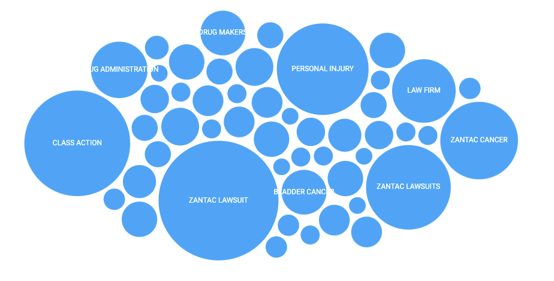

# Documentation
Summary: This is meant to be a sort of 'set it and forget it' kind of script. It takes the complexity of D3 and simplifies it. Which is why I should note, D3 is a complex and powerful tool. My simple modules are not meant to cover the full breadth of what D3 is capable of. If you do not see a feature of D3 that you'd like to use, then unfortunately you will likely just have to use D3 or modify my script for your own purposes. Remember, this is just meant to be simple.

At the time of this writing, I currently only have a Bubble Chart built out, I hope to periodically add more. Also, I'm not a D3 expert by any means. I'm pretty pleb at D3. I just didn't want to have to write out a Bubble Chart a whole bunch of times. I'm all about that DRY Code Lyfe.

## How To
---
### Quick Description
- Add `main.js` script however you'd like.
- Call Bubble Chart Function with Arguments/Parameters `D3BubbleChart(data,container,{options})`

---
### Detailed Descriptions
**STEP ONE**: Add `main.js` script
```html
    <script src="main.js"></script>
```
<span style="color:#6c757d!important">
I recommend applying it before the closing body tag. But hey, you do you boo boo.
</span>

Some possible questions:
+ Can I use Async or Defer Attributes: Sure
+ Can I break out the D3Chart and D3BubbleChart: Yep, but D3Bubble Chart extends D3Chart, so be sure to break out accordingly.

**STEP TWO**: Call BubbleChart Function

Once the script is added, there is a Function that creates a new instance of a Bubble Chart on each Function Call.

```javascript
    BubbleChart(data,container,{options})

    // Data: This will be a JSON Object you provide
    // Container: The ID of the HTML Element to place the Chart in.
    // Options: Optional Parameters for the Chart
```

### The `data` argument (required)
This is the Chart Data that will be displayed.
It requires a JSON string that is an Array of Objects.

For the Bubble Chart Specifically, it looks like this.
**Example:**

```json
    [
        {
            "text":"some words",
            "value":100
        },
        {
            "text":"Other words",
            "value":80
        },
        {
            "text":"more words",
            "value":200
        }
    ]
```

Each Object, represents a single bubble in your bubblechart.

The `text` property of the Object, is the text that you will see inside the Bubble Chart.

The `value` property of the Object, is the Radius of the Bubble.

Here is a visual example of how text and value show up:



### The `Container` argument (required)
The ID of the Element you'd like to place the Chart inside.

#### Few Gotcha's and Notes for the Data Argument
+ The Key of each Object is not relevant. (i.e. "Text" and "value" do not need to be named as such. They can be named as anything)
+ Key Order *is relevant*. (i.e. Bubble Text must come first, Bubble Value must come second)
+ JSON is the only thing it accepts. I don't believe I will be changing it to accept anything else. But, the `_parsedata` method (line 35) of the `class D3Chart` is where it handles the JSON object. Feel free to hack and bend to your will.


### The Options Parameters
Kitchen Sink Example of Options being set:
```javascript
    D3BubbleChart(data,container,{
        height: 300,
        width: 1200,
        bubblelimit: 20,
        bubblecolor: '#FF00AA'
    });
```

Options ( Not Required ):
+ height:Int ( Default 500 )
    + The Height, in Pixels, that you'd like the Bubble Chart to be. Defaults to 500px.
+ width: Int ( Default 1200 )
    + The Width, in Pixels, that you'd like the Bubble Chart to be. Defaults to 1200px.
+ bubblelimit ( Default 10 )
    + The number of Bubbles you'd like to display. Default is set to 10.
+ bubblecolor ( Default #42a7f5 )
    + Accepts HEX and Plain Text values. (i.e Red)

Note: You might be thinking, wow, that's not a lot of options. YEP. I'll be adding them as I need them, so more will be coming, for sure. But, remember, this isn't intended to do everything.

## General Footnotes and Gotchas
---
+ Will you be able to help with troubleshooting?
    + I apologize in advance if you cant get this to work. This is definitely catered to my specific needs with where I'm at currently. I'm hoping I wrote it in a way that is easy to read though, so you're welcome to Fork and adjust.
+ I can't seem to change ( insert option here ), what am I missing?
    + You're likely not missing anything. I probably didn't build it into the options. Don't nuke it and pull your hair out. If its not plain to see in the options, then its not a feature.
    + ~~At the time of this writing, yes, even the colors currently cant be changed. But that is something I'm about to update.~~
+ You suck at Code and probably cooking.
    + Probably, please Like and Subscribe.